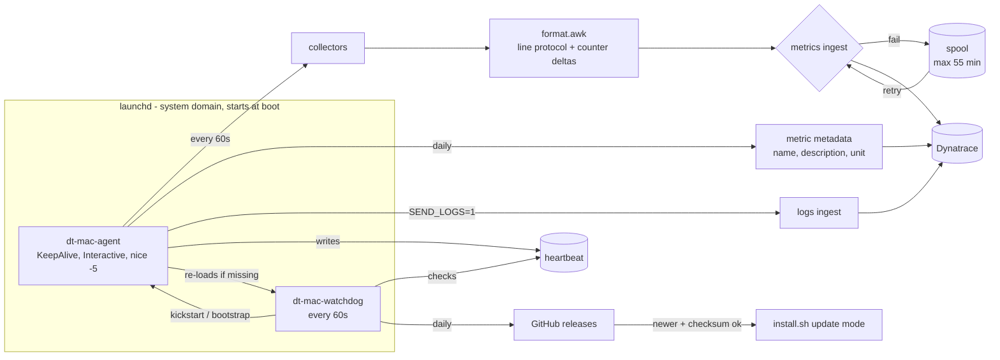

# dt-mac-agent

Lightweight macOS host monitoring agent that pushes CPU, memory, disk, network, power, process and app metrics
to **Dynatrace** every minute. Each metric is sent with its display name, description and unit.

- **Zero dependencies**: pure Bash 3.2 + built-in macOS tools (`top`, `vm_stat`, `sysctl`, `df`, `ioreg`, `netstat`, `ps`, `pmset`, `curl`).
- **Always on**: runs as a root `launchd` daemon at boot (`KeepAlive`, `ProcessType=Interactive`, `Nice=-5`).
- **Self-healing**: a separate watchdog daemon restarts the agent if it is unloaded, stopped or hung.
- **Auto-update**: the watchdog checks GitHub once a day and installs new releases after verifying their SHA-256 checksum.
- **Resilient**: failed batches are buffered on disk and re-sent for up to 55 minutes.
- **Observable**: detailed local logs, optionally shipped to Dynatrace Logs.
- **Tiny footprint**: one ~2 s collection burst per minute, a few MB of RAM.

Current version: see [VERSION](VERSION) · Changes: [CHANGELOG.md](CHANGELOG.md)

---

## Quick start

### 1. Create a Dynatrace token

A classic **API token** (`dt0c01.`) is recommended. Create it under *Access tokens* in your environment:

| Scope | Required? | Used for |
|---|---|---|
| `metrics.ingest` (Ingest metrics) | **Required** | Sending metrics |
| `settings.write` (Write settings) | Recommended | Declaring each metric's name, description, unit and **dimensions** in its metric definition |
| `logs.ingest` (Ingest logs) | Only with `SEND_LOGS=1` | Sending the agent's own logs |

A platform token (`dt0s16.`) also works. It needs `openpipeline:metrics:ingest`, plus `settings:objects:write`
(recommended) and log ingest permission when `SEND_LOGS=1`.

Without the settings scope, metrics still flow and the agent falls back to sending only name, description and unit.
In that case dimensions are not listed in the metric definition. If a scope is missing, Dynatrace answers
`HTTP 403 ... missing required permission`. The error shows in the installer's connection test and in
`dtmacctl logs agent` / `dtmacctl logs ingest`.

### 2. Install (one command, needs root)

```bash
curl -fsSL https://raw.githubusercontent.com/theharithsa/dt-mac-agent/main/install.sh | sudo bash
```

The installer asks for:

| Prompt | Default | Environment variable (unattended installs) |
|---|---|---|
| Install location | `/usr/local/dt-mac-agent` | `DTMA_PREFIX` |
| Dynatrace environment URL | — | `DT_ENV_URL` |
| Dynatrace token (hidden input) | — | `DT_TOKEN` |
| Also send the agent's own logs to Dynatrace? | No | `DTMA_SEND_LOGS=1` |
| Install new releases automatically (daily check)? | Yes | `DTMA_AUTO_UPDATE=0` to disable |

Unattended example (MDM / scripts):

```bash
curl -fsSL https://raw.githubusercontent.com/theharithsa/dt-mac-agent/main/install.sh \
  | sudo DT_ENV_URL="https://<env-id>.live.dynatrace.com" DT_TOKEN="<token>" \
         DTMA_PREFIX=/opt/dt-mac-agent DTMA_SEND_LOGS=1 bash
```

The installer:

1. Downloads the latest GitHub release and verifies its SHA-256 checksum.
2. Installs to the chosen location and links `dtmacctl` into `/usr/local/bin`.
3. Writes `/etc/dt-mac-agent/config` (`root:wheel`, mode `600`).
4. Sends a test metric. **If Dynatrace rejects it, the agent is not started.**
5. Loads the agent and watchdog `launchd` daemons.
6. Waits for the agent's first real metric batch and reports `Successfully connected to Dynatrace environment <url>`
   (and verifies log shipping when enabled) before printing the final success message.

The install location must be a dedicated directory and every parent directory must be owned by root
(the program runs as root). Paths under `/Users`, `/tmp`, `/var` and system folders are refused.

Re-running the installer upgrades in place and keeps your settings. Pass `DT_TOKEN` again to rotate the token, or
`DTMA_PREFIX` to move the installation. Pin a version with `DTMA_VERSION=0.1.0`.

### 3. Verify

```bash
sudo dtmacctl status
```

```text
dt-mac-agent 0.1.0
  agent     : loaded, state=running, pid=812, last exit=(never exited)
  watchdog  : loaded, state=not running, pid=, last exit=0
  heartbeat : 14s ago
  last send : 2026-10-05 10:31:00 (436 lines, ok 202)
  spool     : 0 buffered batches
  restarts  : 0 (by watchdog)
  log ship  : enabled, last result ok
  auto-upd. : enabled, last check 2026-10-05 10:20
  endpoint  : https://<env-id>.live.dynatrace.com/api/v2/metrics/ingest
  home      : /usr/local/dt-mac-agent
  logs      : /Library/Logs/dt-mac-agent
```

The watchdog shows `not running` between its 60-second runs. That is expected.

---

## Commands

| Command | Description |
|---|---|
| `sudo dtmacctl status` | Agent/watchdog state, heartbeat, last ingest, log shipping, auto-update |
| `sudo dtmacctl start` / `stop` | Start / stop agent + watchdog (`stop` survives reboots until `start`) |
| `sudo dtmacctl restart` | Restart the agent |
| `sudo dtmacctl update [--check]` | Install the latest release now (`--check` only reports) |
| `dtmacctl logs [agent\|ingest\|watchdog\|install] [-f]` | Show / follow logs (default: all) |
| `dtmacctl payload` | Print the last metric batch sent to Dynatrace |
| `dtmacctl metrics` | List all metrics with type, unit and description |
| `dtmacctl test` | Collect once and print the metric lines, nothing is sent |
| `sudo dtmacctl send-test` | Send one test metric to validate URL + token |
| `sudo dtmacctl config` | Print config with the token masked |
| `sudo dtmacctl uninstall [--keep-config]` | Remove everything |

---

## Architecture



- **Agent**: collects, formats and sends one batch per interval (aligned to the minute), then writes a heartbeat.
  launchd restarts it immediately if it exits.
- **Watchdog**: separate launchd job. Restarts the agent if the job is unloaded, not running, or the heartbeat is
  older than 3× the interval. Once a day it checks GitHub for a newer release (see [Auto-update](#auto-update)).
- **Security**: the token is stored only in `/etc/dt-mac-agent/config` (root-only). It is passed to `curl` via stdin,
  so it never appears in `ps` output or in logs.

### Files

| Path | Purpose |
|---|---|
| `<install location>/` (default `/usr/local/dt-mac-agent`) | Program files |
| `/etc/dt-mac-agent/config` | Configuration (see [etc/config.example](etc/config.example)) |
| `/var/lib/dt-mac-agent/` | Heartbeat, counter state, spool, log-shipping offsets |
| `/Library/Logs/dt-mac-agent/` | Logs, see [Logs](#logs) |
| `/Library/LaunchDaemons/com.theharithsa.dt-mac-agent*.plist` | launchd jobs |

---

## Metrics

All metric keys start with `macos.` (configurable via `METRIC_PREFIX`). Each metric's display name, description,
unit and dimensions are declared in Dynatrace (Settings schema `builtin:metric.metadata`, tagged `dt-mac-agent`) at
start-up, after every upgrade and once a day. Metrics ending in `.count` are counters sent as per-interval deltas.
Use `rate:` in DQL to get per-second values. Dimension display names come from [lib/dimensions.tsv](lib/dimensions.tsv).

### Dimensions

Every metric carries the host dimensions:

| Dimension | Example |
|---|---|
| `host.name` | `Machy` |
| `host.arch` | `arm64` |
| `host.model` | `Mac14,12` |
| `os.type` | `macos` |
| `os.version` | `27.0.1` |

Additional dimensions per group:

| Metrics | Dimensions |
|---|---|
| `macos.disk.*` (usage) | `disk.mount`, `disk.device` |
| `macos.disk.io.*` | `disk.device` |
| `macos.net.*` (except `tcp.established`) | `network.interface` |
| `macos.process.*` | `process.executable.name`, `process.owner`, `app.name`, `process.executable.path` |
| `macos.app.*` | `app.name`, `app.bundle.id`, `app.type` (`user` \| `system`) |
| `macos.agent.heartbeat` | `agent.version` |

**Processes** are grouped by executable name and owner. For example, all `Code Helper (Renderer)` instances form one
stable series, and `process.instances` tells you how many PIDs there are. Each minute the agent reports the union of
the top 10 process groups by CPU and the top 10 by memory (`TOP_N`). Rank them in DQL with `sort ... desc`, as in
the examples below.

**Apps**: every running `.app` bundle is reported. All of an app's helper processes are summed under the outermost
bundle, so Chrome, Teams, VS Code and similar apps report their full footprint.

### Reference

| Metric | Unit | Name | Description |
|---|---|---|---|
| `macos.cpu.usage` | Percent | CPU usage | Total CPU utilization (user + system) across all cores, sampled over 1 second. |
| `macos.cpu.user` | Percent | CPU user time | Share of CPU time spent in user-space processes. |
| `macos.cpu.system` | Percent | CPU system time | Share of CPU time spent in the kernel. |
| `macos.cpu.idle` | Percent | CPU idle time | Share of CPU time spent idle. |
| `macos.cpu.load1` | Unspecified | CPU load average (1 min) | Average number of runnable threads over the last minute. |
| `macos.cpu.load5` | Unspecified | CPU load average (5 min) | Average number of runnable threads over the last 5 minutes. |
| `macos.cpu.load15` | Unspecified | CPU load average (15 min) | Average number of runnable threads over the last 15 minutes. |
| `macos.cpu.cores.logical` | Count | CPU logical cores | Number of logical CPU cores. |
| `macos.cpu.cores.physical` | Count | CPU physical cores | Number of physical CPU cores. |
| `macos.cpu.speed_limit` | Percent | CPU speed limit | Thermal CPU speed limit (100 = not throttled). Intel Macs only. |
| `macos.cpu.scheduler_limit` | Percent | CPU scheduler limit | Thermal CPU scheduler limit (100 = not throttled). Intel Macs only. |
| `macos.system.thermal.warning` | Unspecified | Thermal warning | 1 when macOS has recorded a thermal warning, otherwise 0. |
| `macos.system.processes` | Count | Processes | Total number of processes. |
| `macos.system.threads` | Count | Threads | Total number of threads. |
| `macos.system.uptime` | Second | Uptime | Time since the last boot. |
| `macos.system.users` | Count | Logged-in sessions | Number of logged-in user sessions. |
| `macos.system.open_files` | Count | Open files | Number of open file descriptors system-wide. |
| `macos.system.open_files.max` | Count | Open files limit | Maximum number of open file descriptors system-wide. |
| `macos.memory.total` | Byte | Memory total | Installed physical memory. |
| `macos.memory.used` | Byte | Memory used | App + wired + compressed memory (as shown in Activity Monitor). |
| `macos.memory.free` | Byte | Memory free | Free and speculative memory pages. |
| `macos.memory.app` | Byte | Memory used by apps | Anonymous memory used by applications, excluding purgeable memory. |
| `macos.memory.wired` | Byte | Memory wired | Memory that cannot be compressed or paged out. |
| `macos.memory.compressed` | Byte | Memory compressed | Physical memory occupied by the memory compressor. |
| `macos.memory.cached` | Byte | Memory cached files | File-backed and purgeable memory that can be reclaimed. |
| `macos.memory.usage` | Percent | Memory usage | Memory used as a percentage of total memory. |
| `macos.memory.pressure.level` | Unspecified | Memory pressure level | macOS memory pressure: 1 = normal, 2 = warning, 4 = critical. |
| `macos.memory.available.percent` | Percent | Memory available | Kernel memory availability level (higher is better). |
| `macos.memory.swap.total` | Byte | Swap total | Size of the swap files. |
| `macos.memory.swap.used` | Byte | Swap used | Swap space in use. |
| `macos.memory.swap.usage` | Percent | Swap usage | Swap used as a percentage of swap total. |
| `macos.memory.pageins.count` | Count | Page-ins | Pages read from disk into memory during the interval. |
| `macos.memory.pageouts.count` | Count | Page-outs | Pages written from memory to disk during the interval. |
| `macos.memory.swapins.count` | Count | Swap-ins | Pages swapped in during the interval. |
| `macos.memory.swapouts.count` | Count | Swap-outs | Pages swapped out during the interval. |
| `macos.memory.compressions.count` | Count | Memory compressions | Pages compressed during the interval. |
| `macos.memory.decompressions.count` | Count | Memory decompressions | Pages decompressed during the interval. |
| `macos.disk.total` | Byte | Disk capacity | Capacity of the volume. |
| `macos.disk.used` | Byte | Disk used | Space used on the volume. |
| `macos.disk.free` | Byte | Disk free | Space available on the volume. |
| `macos.disk.usage` | Percent | Disk usage | Used space as a percentage of used + available. |
| `macos.disk.inodes.used` | Count | Inodes used | Number of used inodes on the volume. |
| `macos.disk.inodes.free` | Count | Inodes free | Number of free inodes on the volume. |
| `macos.disk.io.read.bytes.count` | Byte | Disk bytes read | Bytes read from the disk during the interval. |
| `macos.disk.io.write.bytes.count` | Byte | Disk bytes written | Bytes written to the disk during the interval. |
| `macos.disk.io.read.ops.count` | Count | Disk read operations | Read operations during the interval. |
| `macos.disk.io.write.ops.count` | Count | Disk write operations | Write operations during the interval. |
| `macos.disk.io.read.time.count` | NanoSecond | Disk read time | Total time spent on reads during the interval (divide by read operations for latency). |
| `macos.disk.io.write.time.count` | NanoSecond | Disk write time | Total time spent on writes during the interval (divide by write operations for latency). |
| `macos.disk.io.errors.count` | Count | Disk I/O errors | Read and write errors during the interval. |
| `macos.net.bytes.in.count` | Byte | Network bytes received | Bytes received on the interface during the interval. |
| `macos.net.bytes.out.count` | Byte | Network bytes sent | Bytes sent on the interface during the interval. |
| `macos.net.packets.in.count` | Count | Network packets received | Packets received on the interface during the interval. |
| `macos.net.packets.out.count` | Count | Network packets sent | Packets sent on the interface during the interval. |
| `macos.net.errors.in.count` | Count | Network receive errors | Receive errors on the interface during the interval. |
| `macos.net.errors.out.count` | Count | Network send errors | Send errors on the interface during the interval. |
| `macos.net.tcp.established` | Count | TCP connections established | Number of TCP connections in ESTABLISHED state. |
| `macos.power.on_ac` | Unspecified | On AC power | 1 when running on AC power, 0 on battery. |
| `macos.battery.percent` | Percent | Battery charge | Battery state of charge. |
| `macos.battery.charging` | Unspecified | Battery charging | 1 while the battery is charging, otherwise 0. |
| `macos.battery.cycle_count` | Count | Battery cycle count | Battery charge cycle count. |
| `macos.battery.health` | Percent | Battery health | Current maximum capacity as a percentage of design capacity. |
| `macos.battery.temperature` | Unspecified | Battery temperature (°C) | Battery temperature in degrees Celsius. |
| `macos.process.cpu` | Percent | Process CPU usage | CPU used by all instances of the process, in % of one core (can exceed 100). |
| `macos.process.memory.rss` | Byte | Process memory (RSS) | Resident memory of all instances of the process. |
| `macos.process.memory.percent` | Percent | Process memory usage | Resident memory of the process as a percentage of physical memory. |
| `macos.process.threads` | Count | Process threads | Threads across all instances of the process. |
| `macos.process.instances` | Count | Process instances | Number of running instances (PIDs) of the process. |
| `macos.app.cpu` | Percent | App CPU usage | CPU used by the app and all its helper processes, in % of one core (can exceed 100). |
| `macos.app.memory.rss` | Byte | App memory (RSS) | Resident memory of the app and all its helper processes. |
| `macos.app.memory.percent` | Percent | App memory usage | Resident memory of the app as a percentage of physical memory. |
| `macos.app.processes` | Count | App processes | Number of processes belonging to the app. |
| `macos.app.threads` | Count | App threads | Threads across all processes of the app. |
| `macos.apps.running` | Count | Running apps | Number of running .app bundles (user and system). |
| `macos.apps.running.user` | Count | Running user apps | Number of running apps from /Applications, /System/Applications or ~/Applications. |
| `macos.agent.heartbeat` | Unspecified | Agent heartbeat | Always 1; reported once per collection cycle. |
| `macos.agent.collect.duration` | Second | Agent collection duration | Time taken to collect one batch. |
| `macos.agent.spool.files` | Count | Agent buffered batches | Batches waiting to be re-sent after a failed ingest. |
| `macos.agent.ingest.failures.count` | Count | Agent ingest failures | Failed metric ingest requests during the interval. |
| `macos.agent.watchdog.restarts.count` | Count | Agent watchdog restarts | Agent restarts triggered by the watchdog during the interval. |

The source of truth is [lib/metrics.tsv](lib/metrics.tsv). CI fails if the agent emits a metric that is missing there.

---

## Example DQL

```sql
// CPU and memory per Mac
timeseries cpu = avg(macos.cpu.usage), mem = avg(macos.memory.usage), by: { host.name }
```

```sql
// Top 10 processes by CPU
timeseries cpu = avg(macos.process.cpu), by: { host.name, process.executable.name, app.name }
| fieldsAdd avg_cpu = arrayAvg(cpu)
| sort avg_cpu desc
| limit 10
```

```sql
// Top 10 processes by memory
timeseries mem = avg(macos.process.memory.rss), by: { host.name, process.executable.name, process.owner }
| fieldsAdd avg_mem = arrayAvg(mem)
| sort avg_mem desc
| limit 10
```

```sql
// Heaviest apps by CPU and memory
timeseries cpu = avg(macos.app.cpu), mem = avg(macos.app.memory.rss), by: { host.name, app.name, app.bundle.id }
| fieldsAdd avg_cpu = arrayAvg(cpu), avg_mem = arrayAvg(mem)
| sort avg_mem desc
| limit 10
```

```sql
// Network throughput (bytes/s) per interface
timeseries rx = sum(macos.net.bytes.in.count, rate: 1s), tx = sum(macos.net.bytes.out.count, rate: 1s),
  by: { host.name, network.interface }
```

```sql
// Disk read latency (ms) per disk
timeseries t = sum(macos.disk.io.read.time.count), ops = sum(macos.disk.io.read.ops.count), by: { host.name, disk.device }
| fieldsAdd latency_ms = t[] / ops[] / 1000000
```

```sql
// Agent logs (SEND_LOGS=1)
fetch logs
| filter service.name == "dt-mac-agent"
| fields timestamp, host.name, dt_mac_agent.component, loglevel, content
| sort timestamp desc
```

---

## Logs

All logs are written to `/Library/Logs/dt-mac-agent/`, appear in **Console.app** under *Log Reports*, and are rotated
by `newsyslog`. Runtime logs never contain the token, so you can read them without `sudo`.

| File | Contents |
|---|---|
| `ingest.log` | One line per batch: lines, bytes, HTTP result, accepted/invalid, timings, spool size, per-category breakdown; metadata sends |
| `last-payload.txt` | The most recent batch exactly as sent (`dtmacctl payload`) |
| `payloads.log` | Every full batch, only when `LOG_PAYLOADS=1` |
| `agent.log` | Agent lifecycle, warnings and errors (start/stop, ingest failures, collector errors, log shipping status) |
| `watchdog.log` | Result of every watchdog check (each minute), restarts and update checks |
| `install.log` | Full installer output, including automatic updates (readable by admin users) |
| `*.stdout.log` / `*.stderr.log` | Raw process output captured by launchd (normally empty) |

### Shipping logs to Dynatrace

With `SEND_LOGS=1` (installer prompt or `DTMA_SEND_LOGS=1`), the agent sends new lines from `agent.log`,
`ingest.log`, `watchdog.log` and `install.log` to the Dynatrace log ingest API every minute. Each record carries
`service.name=dt-mac-agent`, `dt_mac_agent.component`, `log.source`, `host.name`, `os.type`, `os.version` and
`agent.version`, with the original timestamp and log level. Read positions survive restarts and log rotation.
If sending fails, the lines are retried on the next cycle.

---

## Auto-update

With `AUTO_UPDATE=1` (the default), the watchdog checks
[GitHub releases](https://github.com/theharithsa/dt-mac-agent/releases) once every 24 hours. When a newer version
exists, it:

1. Downloads the release archive and its `.sha256` file and verifies the checksum. On a mismatch, nothing is installed.
2. Runs the release's `install.sh` in update mode. This keeps your install location and settings, replaces the
   program files and restarts the agent.
3. Writes everything to `watchdog.log` and `install.log`.

Update manually with `sudo dtmacctl update`, or check without installing using `sudo dtmacctl update --check`.
Disable automatic updates with `AUTO_UPDATE=0` in the config.

> Versions before 0.1.0 have no auto-update. Upgrade them once by re-running the install command.

---

## Configuration

Edit `/etc/dt-mac-agent/config`, then run `sudo dtmacctl restart`.

| Key | Default | Description |
|---|---|---|
| `DT_ENV_URL` | — | `https://<env-id>.live.dynatrace.com` (`.apps.` is accepted too) |
| `DT_TOKEN` | — | Platform (`dt0s16.`) or API (`dt0c01.`) token |
| `SEND_LOGS` | `0` | `1` = ship the agent's logs to Dynatrace |
| `AUTO_UPDATE` | `1` | `1` = install new releases automatically (daily check) |
| `METRIC_PREFIX` | `macos` | Metric key prefix |
| `TOP_N` | `10` | Process groups per ranking (CPU and memory) |
| `INTERVAL` | `60` | Collection interval in seconds (min 10) |
| `SPOOL_MAX_AGE_MIN` | `55` | Retry window for failed batches (Dynatrace rejects data > 1 h old) |
| `SPOOL_MAX_FILES` | `120` | Max buffered batches |
| `LOG_PAYLOADS` | `0` | `1` = append every full batch to `payloads.log` |
| `DT_INGEST_URL` / `DT_LOGS_URL` | auto | Full endpoint overrides (Managed / ActiveGate) |

Endpoints are derived from `DT_ENV_URL` and the token type:

| Token | Metrics / logs / settings endpoint |
|---|---|
| API token `dt0c01.` | `https://<env-id>.live.dynatrace.com/api/v2/{metrics/ingest,logs/ingest,settings/objects}` |
| Platform token `dt0s16.` | `https://<env-id>.apps.dynatrace.com/platform/classic/environment-api/v2/{...}` |

`DT_ENV_URL` can be given with `.live.` or `.apps.`; the agent picks the right host for the token type.

---

## Troubleshooting

| Symptom | Fix |
|---|---|
| `HTTP 401` | Token invalid or expired. Re-run the installer with `DT_TOKEN=<new>` |
| `HTTP 403 ... missing required permission` | Add the named permission to the token (see the token table) |
| `HTTP 400` | Some lines were rejected. Details are in `dtmacctl logs ingest` |
| No data after install | `sudo dtmacctl status`, then `sudo dtmacctl send-test` |
| Agent keeps restarting | `dtmacctl logs agent` and `/Library/Logs/dt-mac-agent/agent.stderr.log` |
| Update did not install | `dtmacctl logs watchdog` and `dtmacctl logs install` |

## Uninstall

```bash
sudo dtmacctl uninstall
# or
curl -fsSL https://raw.githubusercontent.com/theharithsa/dt-mac-agent/main/uninstall.sh | sudo bash
```

## Development

```bash
bash bin/dt-mac-agent --dry-run        # collect once and print lines, no root needed
bash bin/dtmacctl metrics              # metric catalog
sudo ./install.sh                      # install from the local checkout
```

### Versioning and releases

The project follows [Semantic Versioning](https://semver.org). The version lives in [VERSION](VERSION).
To release: bump `VERSION`, add a section to [CHANGELOG.md](CHANGELOG.md), commit, then push a tag such as
`git tag v0.1.1 && git push origin v0.1.1`. CI lints the scripts, verifies the metric catalog, builds
`dt-mac-agent-<version>.tar.gz` plus its `.sha256`, and publishes the GitHub release. Installed agents with
auto-update enabled pick it up within 24 hours.

## License

[MIT](LICENSE)
