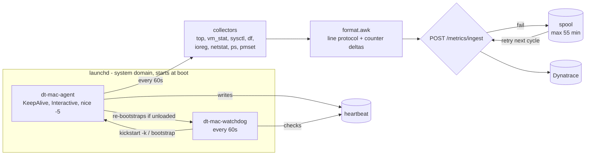

# dt-mac-agent

Lightweight macOS host monitoring agent that pushes CPU, memory, disk, network, power,
top-process and running-app metrics to **Dynatrace** every minute.

- **Zero dependencies**: pure Bash 3.2 + built-in macOS tools (`top`, `vm_stat`, `sysctl`, `df`, `ioreg`, `netstat`, `ps`, `pmset`, `curl`).
- **Always on**: runs as a root `launchd` daemon at boot (`KeepAlive`, `ProcessType=Interactive`, `Nice=-5`).
- **Self-healing**: a separate watchdog daemon restarts the agent if it is unloaded, stopped or hung.
- **Resilient**: failed batches are buffered on disk and re-sent for up to 55 minutes.
- **Tiny footprint**: one ~2 s collection burst per minute, a few MB of RAM, ~300–400 metric lines per batch.

Current version: see [VERSION](VERSION) · Changes: [CHANGELOG.md](CHANGELOG.md)

---

## Quick start

### 1. Create a Dynatrace token

| Token type | Prefix | Required permission / scope |
|---|---|---|
| Platform token (recommended) | `dt0s16.` | `openpipeline:metrics:ingest` |
| Classic API token | `dt0c01.` | `metrics.ingest` |

### 2. Install (one command, needs root)

Interactive (prompts for URL and token; the token is not echoed and does not end up in shell history):

```bash
curl -fsSL https://raw.githubusercontent.com/theharithsa/dt-mac-agent/main/install.sh | sudo bash
```

Unattended (MDM / scripts):

```bash
curl -fsSL https://raw.githubusercontent.com/theharithsa/dt-mac-agent/main/install.sh \
  | sudo DT_ENV_URL="https://<env-id>.apps.dynatrace.com" DT_TOKEN="<token>" bash
```

The installer:

1. Downloads the latest GitHub release and verifies its SHA-256 checksum.
2. Installs to `/usr/local/dt-mac-agent` and links `dtmacctl` into `/usr/local/bin`.
3. Writes `/etc/dt-mac-agent/config` (`root:wheel`, mode `600`).
4. Sends a test metric. **If Dynatrace rejects it, the agent is not started.**
5. Loads the agent and watchdog `launchd` daemons.

Pin a version with `DTMA_VERSION=0.0.2`. Re-running the installer upgrades in place and keeps your config
(pass `DT_TOKEN` again to rotate the token).

### 3. Verify

```bash
sudo dtmacctl status
```

```text
dt-mac-agent 0.0.2
  agent     : loaded, state=running, pid=812, last exit=(never exited)
  watchdog  : loaded, state=not running, pid=, last exit=0
  heartbeat : 14s ago
  last send : 2026-10-05 10:31:00 (371 lines, ok 202)
  spool     : 0 buffered batches
  restarts  : 0 (by watchdog)
  endpoint  : https://<env-id>.apps.dynatrace.com/platform/classic/environment-api/v2/metrics/ingest
```

The watchdog shows `not running` between its 60-second runs. That is expected.

---

## Commands

| Command | Description |
|---|---|
| `sudo dtmacctl status` | Agent/watchdog state, heartbeat age, last ingest result, spool size |
| `sudo dtmacctl start` | Enable and start agent + watchdog |
| `sudo dtmacctl stop` | Stop both (stays stopped across reboots until `start`) |
| `sudo dtmacctl restart` | Restart the agent |
| `dtmacctl logs [agent\|ingest\|watchdog\|install] [-f]` | Show / follow logs (default: all) |
| `dtmacctl payload` | Print the last metric batch sent to Dynatrace |
| `dtmacctl test` | Collect once and print the metric lines, nothing is sent |
| `sudo dtmacctl send-test` | Send one test metric to validate URL + token |
| `sudo dtmacctl config` | Print config with the token masked |
| `sudo dtmacctl uninstall [--keep-config]` | Remove everything |

---

## Architecture



- **Agent**: collects, formats and sends one batch per interval (aligned to the minute), then writes a heartbeat.
  launchd restarts it immediately if it exits (`KeepAlive`).
- **Watchdog**: separate launchd job. Restarts the agent if the job is unloaded, not running, or if the heartbeat is
  older than 3× the interval (hung). The agent in turn re-loads the watchdog if it disappears.
- **Security**: the token lives only in `/etc/dt-mac-agent/config` (root-only) and is passed to `curl` via stdin,
  so it never shows up in `ps` output or logs.

### Files

| Path | Purpose |
|---|---|
| `/usr/local/dt-mac-agent/` | Program files |
| `/etc/dt-mac-agent/config` | Configuration (see [etc/config.example](etc/config.example)) |
| `/var/lib/dt-mac-agent/` | Heartbeat, counter state, spool |
| `/Library/Logs/dt-mac-agent/` | Logs, see [Logs](#logs) |
| `/Library/LaunchDaemons/com.theharithsa.dt-mac-agent*.plist` | launchd jobs |

---

## Metrics

Every metric carries the dimensions `host.name`, `os.version`, `hw.model`, `arch`.
Metrics ending in `.count` are counters sent as per-interval deltas. Default prefix: `macos.`

### CPU and system

| Metric | Unit | Notes |
|---|---|---|
| `macos.cpu.usage` / `.user` / `.system` / `.idle` | % | 1-second sample from `top` |
| `macos.cpu.load1` / `.load5` / `.load15` | load | Load averages |
| `macos.cpu.cores.logical` / `.physical` | count | |
| `macos.cpu.speed_limit` / `.scheduler_limit` | % | Thermal throttling (Intel Macs) |
| `macos.system.thermal.warning` | 0/1 | Thermal warning recorded |
| `macos.system.processes` / `.threads` | count | |
| `macos.system.uptime` | s | |
| `macos.system.users` | count | Logged-in sessions |
| `macos.system.open_files` / `.open_files.max` | count | |

### Memory

| Metric | Unit | Notes |
|---|---|---|
| `macos.memory.total` / `.used` / `.free` | bytes | `used` = app + wired + compressed (Activity Monitor) |
| `macos.memory.app` / `.wired` / `.compressed` / `.cached` | bytes | |
| `macos.memory.usage` | % | |
| `macos.memory.pressure.level` | level | 1 = normal, 2 = warning, 4 = critical |
| `macos.memory.available.percent` | % | Kernel memory availability level |
| `macos.memory.swap.total` / `.used` / `.usage` | bytes / % | |
| `macos.memory.pageins.count` / `pageouts` / `swapins` / `swapouts` / `compressions` / `decompressions` | pages | |

### Disk

| Metric | Unit | Dimensions |
|---|---|---|
| `macos.disk.total` / `.used` / `.free` | bytes | `mount`, `device` |
| `macos.disk.usage` | % | `mount`, `device` |
| `macos.disk.inodes.used` / `.free` | count | `mount`, `device` |
| `macos.disk.io.read.bytes.count` / `write.bytes.count` | bytes | `disk` |
| `macos.disk.io.read.ops.count` / `write.ops.count` | ops | `disk` |
| `macos.disk.io.read.time_ns.count` / `write.time_ns.count` | ns | `disk` (latency = time / ops) |
| `macos.disk.io.errors.count` | count | `disk` |

Volumes reported: `/`, `/System/Volumes/Data` and external volumes under `/Volumes/`.

### Network

| Metric | Unit | Dimensions |
|---|---|---|
| `macos.net.bytes.in.count` / `.out.count` | bytes | `interface` |
| `macos.net.packets.in.count` / `.out.count` | packets | `interface` |
| `macos.net.errors.in.count` / `.out.count` | count | `interface` |
| `macos.net.tcp.established` | count | |

### Power (laptops)

`macos.power.on_ac`, `macos.battery.percent`, `macos.battery.charging`, `macos.battery.cycle_count`,
`macos.battery.health` (% of design capacity), `macos.battery.temperature` (°C).

### Top processes

The top 10 processes **by CPU** and the top 10 **by memory**, ranked in descending order.

| Metric | Unit |
|---|---|
| `macos.process.cpu` | % of one core (can exceed 100) |
| `macos.process.memory.rss` | bytes |
| `macos.process.memory.percent` | % of physical memory |
| `macos.process.threads` | count |

Dimensions: `top.by` (`cpu` \| `memory`), `rank` (1 = highest), `process.name`, `pid`, `user`, `app.name`.

### Running apps

Every running `.app` bundle is detected automatically. All of an app's helper processes are summed under the
outermost bundle, so Chrome, Teams, VS Code and similar apps report their full footprint.

| Metric | Unit | Dimensions |
|---|---|---|
| `macos.app.cpu` | % | `app.name`, `app.type` (`user` \| `system`) |
| `macos.app.memory.rss` | bytes | `app.name`, `app.type` |
| `macos.app.processes` | count | `app.name`, `app.type` |
| `macos.apps.running` / `.running.user` | count | |

### Agent self-monitoring

`macos.agent.heartbeat` (dimension `agent.version`), `macos.agent.collect.seconds`, `macos.agent.spool.files`,
`macos.agent.ingest.failures.count`, `macos.agent.watchdog.restarts.count`.

---

## Example DQL

```sql
// CPU and memory per Mac
timeseries cpu = avg(macos.cpu.usage), mem = avg(macos.memory.usage), by: { host.name }
```

```sql
// Top 10 processes by CPU over the timeframe
timeseries cpu = avg(macos.process.cpu), by: { host.name, process.name },
  filter: { top.by == "cpu" }
| fieldsAdd avg_cpu = arrayAvg(cpu)
| sort avg_cpu desc
| limit 10
```

```sql
// Heaviest apps by memory
timeseries mem = avg(macos.app.memory.rss), by: { host.name, app.name }
| fieldsAdd avg_mem = arrayAvg(mem)
| sort avg_mem desc
| limit 10
```

```sql
// Network throughput (bytes/s) per interface
timeseries rx = sum(macos.net.bytes.in.count, rate: 1s), tx = sum(macos.net.bytes.out.count, rate: 1s),
  by: { host.name, interface }
```

```sql
// Agents that stopped reporting
timeseries hb = sum(macos.agent.heartbeat), by: { host.name, agent.version }
| fieldsAdd last = arrayLast(hb)
| filter isNull(last)
```

---

## Configuration

Edit `/etc/dt-mac-agent/config`, then run `sudo dtmacctl restart`.

| Key | Default | Description |
|---|---|---|
| `DT_ENV_URL` | — | `https://<env-id>.apps.dynatrace.com` |
| `DT_TOKEN` | — | Platform (`dt0s16.`) or API (`dt0c01.`) token |
| `DT_INGEST_URL` | auto | Full endpoint override (Managed / ActiveGate) |
| `METRIC_PREFIX` | `macos` | Metric key prefix |
| `TOP_N` | `10` | Processes per ranking |
| `INTERVAL` | `60` | Collection interval in seconds (min 10) |
| `SPOOL_MAX_AGE_MIN` | `55` | Retry window for failed batches (Dynatrace rejects data > 1 h old) |
| `SPOOL_MAX_FILES` | `120` | Max buffered batches |
| `LOG_PAYLOADS` | `0` | `1` = append every full batch to `payloads.log` |

Endpoint selection: platform tokens use `<DT_ENV_URL>/platform/classic/environment-api/v2/metrics/ingest`,
classic API tokens use `https://<env-id>.live.dynatrace.com/api/v2/metrics/ingest`.

---

## Logs

All logs are written to `/Library/Logs/dt-mac-agent/`. They also appear in **Console.app** under *Log Reports*,
and `newsyslog` rotates them. Runtime logs never contain the token, so you can read them without `sudo`.

| File | Contents |
|---|---|
| `ingest.log` | One line per batch sent to Dynatrace: lines, bytes, HTTP result, accepted/invalid, timings, spool size, per-category breakdown |
| `last-payload.txt` | The most recent batch exactly as sent (`dtmacctl payload`) |
| `payloads.log` | Every full batch, only when `LOG_PAYLOADS=1` |
| `agent.log` | Agent lifecycle, warnings and errors (start/stop, ingest failures, collector errors) |
| `watchdog.log` | Result of every watchdog check (each minute) and any restarts |
| `install.log` | Full installer output (readable by admin users) |
| `*.stdout.log` / `*.stderr.log` | Raw process output captured by launchd (normally empty) |

Example `ingest.log` line:

```text
2026-10-05 10:31:02 +0530 [INFO] batch 371 lines (61234 B): ok 202, accepted=371 invalid=0, collect=2s send=0s, spool=0 | agent=6 app=174 apps=2 cpu=13 disk=26 memory=20 net=49 power=1 process=78 system=8
```

Example `watchdog.log` line:

```text
2026-10-05 10:31:30 +0530 [INFO] ok: agent running (pid 812), heartbeat 28s ago, restarts so far 0
```

---

## Troubleshooting

| Symptom | Fix |
|---|---|
| `HTTP 401` | Token invalid or expired. Re-run the installer with `DT_TOKEN=<new>` |
| `HTTP 403 ... missing required permission` | Add the permission from the token table above |
| `HTTP 400` | Some lines were rejected. Details are in `dtmacctl logs ingest` |
| No data after install | `sudo dtmacctl status`, then `sudo dtmacctl send-test` |
| Agent keeps restarting | `dtmacctl logs agent` and `/Library/Logs/dt-mac-agent/agent.stderr.log` |

## Uninstall

```bash
sudo dtmacctl uninstall
# or
curl -fsSL https://raw.githubusercontent.com/theharithsa/dt-mac-agent/main/uninstall.sh | sudo bash
```

## Development

```bash
bash bin/dt-mac-agent --dry-run        # collect once and print lines, no root needed
sudo ./install.sh                      # install from the local checkout
```

### Versioning and releases

The project follows [Semantic Versioning](https://semver.org). The version lives in [VERSION](VERSION).
To release: bump `VERSION`, add a section to [CHANGELOG.md](CHANGELOG.md), commit, then push a tag such as
`git tag v0.0.2 && git push origin v0.0.2`. CI lints the scripts, builds
`dt-mac-agent-<version>.tar.gz` plus its `.sha256`, and publishes the GitHub release that the installer downloads.

## License

[MIT](LICENSE)
