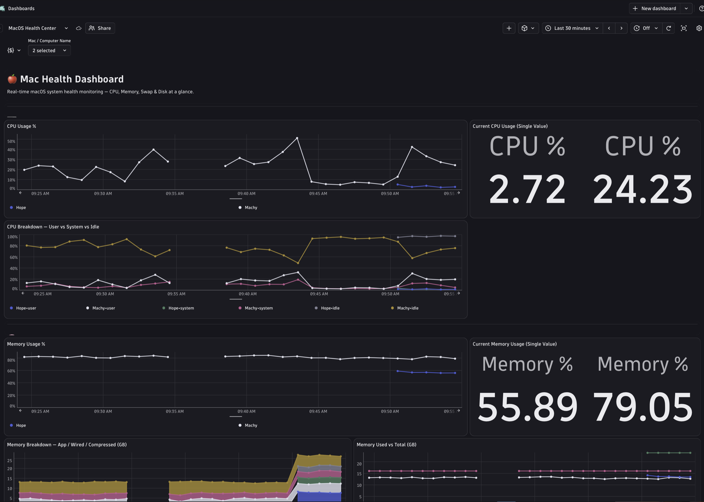
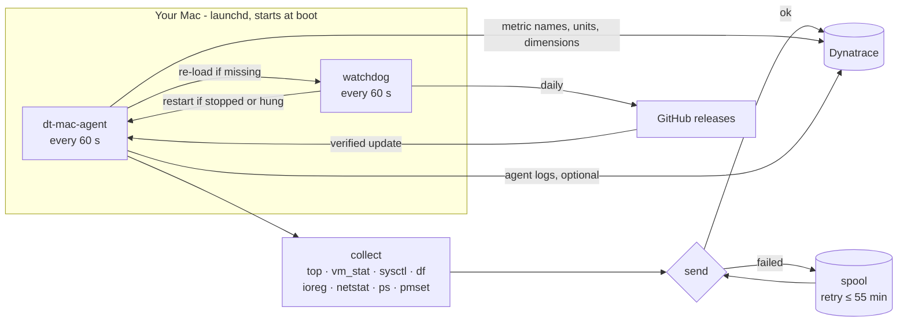

<div align="center">

# 🍎 dt-mac-agent

**Lightweight macOS monitoring agent for Dynatrace**

CPU, memory, disk, network, battery, top processes and running apps, pushed to Dynatrace every minute.<br/>
Zero dependencies · self-healing · auto-updating · one-line install.

[](https://github.com/theharithsa/dt-mac-agent/releases/latest)
[](https://github.com/theharithsa/dt-mac-agent/actions/workflows/ci.yml)
[](https://github.com/theharithsa/dt-mac-agent/actions/workflows/release.yml)
[-success?logo=apple)](#compatibility)
[](#compatibility)
[](.github/workflows/ci.yml)
[](https://www.dynatrace.com)
[](LICENSE)
[](https://github.com/theharithsa/dt-mac-agent/commits/main)



<sub>The bundled <b>MacOS Health Center</b> dashboard, which the installer can upload for you.</sub>

</div>

---

## Contents

- [Why dt-mac-agent?](#why-dt-mac-agent)
- [Quick start (3 steps)](#quick-start-3-steps)
- [What gets collected](#what-gets-collected)
- [Dashboard](#dashboard)
- [Everyday commands](#everyday-commands)
- [How it works](#how-it-works)
- [Configuration](#configuration)
- [Logs](#logs)
- [Auto-update](#auto-update)
- [Example DQL queries](#example-dql-queries)
- [Troubleshooting](#troubleshooting)
- [Uninstall](#uninstall)
- [Compatibility](#compatibility)
- [Development and releases](#development-and-releases)

---

## Why dt-mac-agent?

| | |
|---|---|
| 🪶 **Lightweight** | Pure Bash + built-in macOS tools. One ~2 s collection burst per minute, a few MB of RAM, nothing to install. |
| 🔁 **Always on** | Runs as a root `launchd` daemon from boot, with high scheduling priority. |
| 🩺 **Self-healing** | A separate watchdog restarts the agent if it stops, crashes or hangs. Each one re-loads the other. |
| ⬆️ **Auto-updating** | Checks GitHub once a day and installs new releases after verifying their SHA-256 checksum. |
| 📦 **Resilient** | Failed batches are buffered on disk and re-sent for up to 55 minutes. |
| 🏷️ **Proper metadata** | Every metric has a display name, description, unit and declared dimensions in Dynatrace. |
| 🔎 **Observable** | Detailed local logs (also in Console.app), optionally shipped to Dynatrace Logs. |
| 🔐 **Secure** | Token stored root-only and never shown in `ps` or logs. Downloads are checksum-verified. |

---

## Quick start (3 steps)

### 1️⃣ Create a Dynatrace token

Use **one platform token** (`dt0s16.…`) for everything. It is sent as `Authorization: Bearer <token>`.<br/>
Create it in *Account Management → Identity & access management → Platform tokens* with these scopes:

| Scope | Needed for |
|---|---|
| `openpipeline:metrics:ingest` | ✅ **Required.** Sending metrics |
| `settings:objects:write` | ⭐ Recommended. Shows each metric's dimensions in its metric definition |
| `openpipeline:logs:ingest` | Optional. Only if you send the agent's own logs |
| `document:documents:read` + `document:documents:write` | Optional. Only for the dashboard upload |

> [!IMPORTANT]
> A platform token can only use permissions its **owner** also has. If you get
> `HTTP 403 ... User is missing required permission` even though the scope is on the token, ask your admin to allow it
> in your IAM policy (e.g. `ALLOW openpipeline:metrics:ingest;`). New grants can take a few minutes to take effect.

<details>
<summary>Prefer a classic API token (<code>dt0c01.…</code>)?</summary>

Scopes: `metrics.ingest` (required), `settings.write` (recommended), `logs.ingest` (optional).
Classic tokens can't upload dashboards, so the installer then asks for a platform token just for that upload,
uses it once and does not store it.

</details>

### 2️⃣ Install

```bash
curl -fsSL --connect-timeout 8 --retry 3 https://raw.githubusercontent.com/theharithsa/dt-mac-agent/main/install.sh | sudo bash
```

The installer asks a few questions (press Enter to accept the default):

| Question | Default |
|---|---|
| Install location | `/usr/local/dt-mac-agent` |
| Dynatrace environment URL | e.g. `https://abc12345.live.dynatrace.com` |
| Dynatrace token (input hidden) | — |
| Send the agent's own logs to Dynatrace? | No |
| Install new releases automatically? | Yes |
| Upload the *MacOS Health Center* dashboard? | Yes (first install) |

Then it downloads the release, verifies the checksum, tests the token, starts the agent, and waits until Dynatrace
has accepted the first real batch:

```text
[INFO] Successfully connected to Dynatrace environment https://abc12345.live.dynatrace.com (first batch: 436 metric lines, HTTP 202)
[INFO] Log shipping to Dynatrace verified
[INFO] Dashboard 'MacOS Health Center' created: https://abc12345.apps.dynatrace.com/ui/apps/dynatrace.dashboards/dashboard/dt-mac-agent-health-center
[INFO] dt-mac-agent 0.1.5 installed and running from /usr/local/dt-mac-agent
```

<details>
<summary>Unattended install (MDM, scripts) and all installer options</summary>

Every question can be answered with an environment variable:

| Variable | Meaning |
|---|---|
| `DT_ENV_URL` | Environment URL (`.live.` or `.apps.` both work) |
| `DT_TOKEN` | Dynatrace token |
| `DTMA_PREFIX` | Install location |
| `DTMA_SEND_LOGS=1` | Send the agent's logs to Dynatrace |
| `DTMA_AUTO_UPDATE=0` | Disable automatic updates |
| `DTMA_DASHBOARD=1` | Upload the dashboard |
| `DTMA_DASHBOARD_TOKEN` | Platform token for the dashboard upload when `DT_TOKEN` is a classic token (not stored) |
| `DTMA_VERSION` | Install a specific version, e.g. `0.1.5` |
| `DTMA_SKIP_TEST=1` | Skip the connection test |

```bash
curl -fsSL --connect-timeout 8 --retry 3 https://raw.githubusercontent.com/theharithsa/dt-mac-agent/main/install.sh \
  | sudo DT_ENV_URL="https://<env-id>.live.dynatrace.com" DT_TOKEN="<token>" \
         DTMA_PREFIX=/opt/dt-mac-agent DTMA_SEND_LOGS=1 DTMA_DASHBOARD=1 bash
```

To keep the token out of your shell history, read it into a variable first:
`read -rs "T?Token: "; echo` (zsh), then pass `DT_TOKEN="$T"` and run `unset T` afterwards.

**Install location rules:** the agent runs as root, so the directory must be dedicated, and every parent directory
must be owned by root. Paths under `/Users`, `/tmp`, `/var` and system folders are refused.

**Re-running the installer** upgrades in place and keeps your settings. Pass `DT_TOKEN` to change the token or
`DTMA_PREFIX` to move the installation.

</details>

### 3️⃣ Check it's running

```bash
sudo dtmacctl status
```

```text
dt-mac-agent 0.1.5
  agent     : loaded, state=running, pid=812, last exit=(never exited)
  watchdog  : loaded, state=not running, pid=, last exit=0     ← normal: runs briefly every 60 s
  heartbeat : 14s ago
  last send : 2026-10-05 10:31:00 (436 lines, ok 202)
  spool     : 0 buffered batches
  restarts  : 0 (by watchdog)
  log ship  : enabled, last result ok
  auto-upd. : enabled, last check 2026-10-05 10:20
  endpoint  : https://<env-id>.apps.dynatrace.com/platform/classic/environment-api/v2/metrics/ingest
  home      : /usr/local/dt-mac-agent
  logs      : /Library/Logs/dt-mac-agent
```

That's it. Open the dashboard, or query `macos.*` metrics in a Notebook.

---

## What gets collected

About 80 metrics, every minute, all prefixed `macos.`:

| Area | Highlights | Split by |
|---|---|---|
| 🧠 **CPU** | usage, user / system / idle, load 1-5-15 min, cores, thermal throttling | host |
| 💾 **Memory** | used, app, wired, compressed, cached, free, pressure level, swap, page-ins/outs | host |
| 🗄️ **Disk** | capacity, used, free, usage %, inodes, read/write bytes, ops, latency, errors | mount, device |
| 🌐 **Network** | bytes / packets / errors in & out, established TCP connections | interface |
| 🔋 **Power** | on AC, battery %, charging, cycle count, health, temperature | host |
| ⚙️ **Top processes** | CPU, memory, memory %, threads, instances. Top 10 by CPU + top 10 by memory | process, owner, app |
| 🪟 **Running apps** | CPU, memory, memory %, threads, processes. Helper processes summed per app | app, bundle ID, user/system |
| 🖥️ **System** | processes, threads, uptime, logged-in sessions, open files | host |
| 🩺 **Agent health** | heartbeat, collection time, buffered batches, ingest failures, watchdog restarts | host, version |

Every metric also carries `host.name`, `host.arch`, `host.model`, `os.type` and `os.version`.
Run `dtmacctl metrics` to list them all locally.

<details>
<summary><b>Full metric reference</b> (key, unit, name, description)</summary>

| Metric | Unit | Name | Description |
|---|---|---|---|
| `macos.cpu.usage` | Percent | CPU usage | Total CPU utilization (user + system) across all cores, sampled over 1 second. |
| `macos.cpu.user` | Percent | CPU user time | Share of CPU time spent in user-space processes. |
| `macos.cpu.system` | Percent | CPU system time | Share of CPU time spent in the kernel. |
| `macos.cpu.idle` | Percent | CPU idle time | Share of CPU time spent idle. |
| `macos.cpu.load1` | Unspecified | CPU load average (1 min) | Average number of runnable threads over the last minute. |
| `macos.cpu.load5` | Unspecified | CPU load average (5 min) | Average number of runnable threads over the last 5 minutes. |
| `macos.cpu.load15` | Unspecified | CPU load average (15 min) | Average number of runnable threads over the last 15 minutes. |
| `macos.cpu.cores.logical` | Count | CPU logical cores | Number of logical CPU cores. |
| `macos.cpu.cores.physical` | Count | CPU physical cores | Number of physical CPU cores. |
| `macos.cpu.speed_limit` | Percent | CPU speed limit | Thermal CPU speed limit (100 = not throttled). Intel Macs only. |
| `macos.cpu.scheduler_limit` | Percent | CPU scheduler limit | Thermal CPU scheduler limit (100 = not throttled). Intel Macs only. |
| `macos.system.thermal.warning` | Unspecified | Thermal warning | 1 when macOS has recorded a thermal warning, otherwise 0. |
| `macos.system.processes` | Count | Processes | Total number of processes. |
| `macos.system.threads` | Count | Threads | Total number of threads. |
| `macos.system.uptime` | Second | Uptime | Time since the last boot. |
| `macos.system.users` | Count | Logged-in sessions | Number of logged-in user sessions. |
| `macos.system.open_files` | Count | Open files | Number of open file descriptors system-wide. |
| `macos.system.open_files.max` | Count | Open files limit | Maximum number of open file descriptors system-wide. |
| `macos.memory.total` | Byte | Memory total | Installed physical memory. |
| `macos.memory.used` | Byte | Memory used | App + wired + compressed memory (as shown in Activity Monitor). |
| `macos.memory.free` | Byte | Memory free | Free and speculative memory pages. |
| `macos.memory.app` | Byte | Memory used by apps | Anonymous memory used by applications, excluding purgeable memory. |
| `macos.memory.wired` | Byte | Memory wired | Memory that cannot be compressed or paged out. |
| `macos.memory.compressed` | Byte | Memory compressed | Physical memory occupied by the memory compressor. |
| `macos.memory.cached` | Byte | Memory cached files | File-backed and purgeable memory that can be reclaimed. |
| `macos.memory.usage` | Percent | Memory usage | Memory used as a percentage of total memory. |
| `macos.memory.pressure.level` | Unspecified | Memory pressure level | macOS memory pressure: 1 = normal, 2 = warning, 4 = critical. |
| `macos.memory.available.percent` | Percent | Memory available | Kernel memory availability level (higher is better). |
| `macos.memory.swap.total` | Byte | Swap total | Size of the swap files. |
| `macos.memory.swap.used` | Byte | Swap used | Swap space in use. |
| `macos.memory.swap.usage` | Percent | Swap usage | Swap used as a percentage of swap total. |
| `macos.memory.pageins.count` | Count | Page-ins | Pages read from disk into memory during the interval. |
| `macos.memory.pageouts.count` | Count | Page-outs | Pages written from memory to disk during the interval. |
| `macos.memory.swapins.count` | Count | Swap-ins | Pages swapped in during the interval. |
| `macos.memory.swapouts.count` | Count | Swap-outs | Pages swapped out during the interval. |
| `macos.memory.compressions.count` | Count | Memory compressions | Pages compressed during the interval. |
| `macos.memory.decompressions.count` | Count | Memory decompressions | Pages decompressed during the interval. |
| `macos.disk.total` | Byte | Disk capacity | Capacity of the volume. |
| `macos.disk.used` | Byte | Disk used | Space used on the volume. |
| `macos.disk.free` | Byte | Disk free | Space available on the volume. |
| `macos.disk.usage` | Percent | Disk usage | Used space as a percentage of used + available. |
| `macos.disk.inodes.used` | Count | Inodes used | Number of used inodes on the volume. |
| `macos.disk.inodes.free` | Count | Inodes free | Number of free inodes on the volume. |
| `macos.disk.io.read.bytes.count` | Byte | Disk bytes read | Bytes read from the disk during the interval. |
| `macos.disk.io.write.bytes.count` | Byte | Disk bytes written | Bytes written to the disk during the interval. |
| `macos.disk.io.read.ops.count` | Count | Disk read operations | Read operations during the interval. |
| `macos.disk.io.write.ops.count` | Count | Disk write operations | Write operations during the interval. |
| `macos.disk.io.read.time.count` | NanoSecond | Disk read time | Total time spent on reads during the interval (divide by read operations for latency). |
| `macos.disk.io.write.time.count` | NanoSecond | Disk write time | Total time spent on writes during the interval (divide by write operations for latency). |
| `macos.disk.io.errors.count` | Count | Disk I/O errors | Read and write errors during the interval. |
| `macos.net.bytes.in.count` | Byte | Network bytes received | Bytes received on the interface during the interval. |
| `macos.net.bytes.out.count` | Byte | Network bytes sent | Bytes sent on the interface during the interval. |
| `macos.net.packets.in.count` | Count | Network packets received | Packets received on the interface during the interval. |
| `macos.net.packets.out.count` | Count | Network packets sent | Packets sent on the interface during the interval. |
| `macos.net.errors.in.count` | Count | Network receive errors | Receive errors on the interface during the interval. |
| `macos.net.errors.out.count` | Count | Network send errors | Send errors on the interface during the interval. |
| `macos.net.tcp.established` | Count | TCP connections established | Number of TCP connections in ESTABLISHED state. |
| `macos.power.on_ac` | Unspecified | On AC power | 1 when running on AC power, 0 on battery. |
| `macos.battery.percent` | Percent | Battery charge | Battery state of charge. |
| `macos.battery.charging` | Unspecified | Battery charging | 1 while the battery is charging, otherwise 0. |
| `macos.battery.cycle_count` | Count | Battery cycle count | Battery charge cycle count. |
| `macos.battery.health` | Percent | Battery health | Current maximum capacity as a percentage of design capacity. |
| `macos.battery.temperature` | Unspecified | Battery temperature (°C) | Battery temperature in degrees Celsius. |
| `macos.process.cpu` | Percent | Process CPU usage | CPU used by all instances of the process, in % of one core (can exceed 100). |
| `macos.process.memory.rss` | Byte | Process memory (RSS) | Resident memory of all instances of the process. |
| `macos.process.memory.percent` | Percent | Process memory usage | Resident memory of the process as a percentage of physical memory. |
| `macos.process.threads` | Count | Process threads | Threads across all instances of the process. |
| `macos.process.instances` | Count | Process instances | Number of running instances (PIDs) of the process. |
| `macos.app.cpu` | Percent | App CPU usage | CPU used by the app and all its helper processes, in % of one core (can exceed 100). |
| `macos.app.memory.rss` | Byte | App memory (RSS) | Resident memory of the app and all its helper processes. |
| `macos.app.memory.percent` | Percent | App memory usage | Resident memory of the app as a percentage of physical memory. |
| `macos.app.processes` | Count | App processes | Number of processes belonging to the app. |
| `macos.app.threads` | Count | App threads | Threads across all processes of the app. |
| `macos.apps.running` | Count | Running apps | Number of running .app bundles (user and system). |
| `macos.apps.running.user` | Count | Running user apps | Number of running apps from /Applications, /System/Applications or ~/Applications. |
| `macos.agent.heartbeat` | Unspecified | Agent heartbeat | Always 1; reported once per collection cycle. |
| `macos.agent.collect.duration` | Second | Agent collection duration | Time taken to collect one batch. |
| `macos.agent.spool.files` | Count | Agent buffered batches | Batches waiting to be re-sent after a failed ingest. |
| `macos.agent.ingest.failures.count` | Count | Agent ingest failures | Failed metric ingest requests during the interval. |
| `macos.agent.watchdog.restarts.count` | Count | Agent watchdog restarts | Agent restarts triggered by the watchdog during the interval. |

Source of truth: [lib/metrics.tsv](lib/metrics.tsv) (metrics) and [lib/dimensions.tsv](lib/dimensions.tsv)
(dimension display names). CI fails if the agent emits a metric that isn't in the catalog.

</details>

<details>
<summary><b>Dimensions</b> per metric group</summary>

| Metrics | Dimensions |
|---|---|
| all | `host.name`, `host.arch`, `host.model`, `os.type`, `os.version` |
| `macos.disk.*` (usage) | `disk.mount`, `disk.device` |
| `macos.disk.io.*` | `disk.device` |
| `macos.net.*` (except `tcp.established`) | `network.interface` |
| `macos.process.*` | `process.executable.name`, `process.owner`, `app.name`, `process.executable.path` |
| `macos.app.*` | `app.name`, `app.bundle.id`, `app.type` (`user` \| `system`) |
| `macos.agent.heartbeat` | `agent.version` |

- **Processes** are grouped by executable name and owner, so all `Code Helper (Renderer)` instances form one
  stable series. `process.instances` gives the number of PIDs.
- **Apps** sum all helper processes under the outermost `.app` bundle, so Chrome, Teams, VS Code and similar
  apps report their full footprint.
- Metrics ending in `.count` are per-minute deltas. Use `rate: 1s` in DQL for per-second values.
- `process.cpu` / `app.cpu` are % of **one** core, so they can exceed 100.

</details>

---

## Dashboard


[Dashboard/MacOS Health Center.json](Dashboard/MacOS%20Health%20Center.json) shows CPU, memory, swap and disk
for each Mac, with a *Mac / Computer Name* filter.

| How | Command |
|---|---|
| During installation | Answer **Yes** to the dashboard question (or `DTMA_DASHBOARD=1`) |
| Any time later | `sudo dtmacctl dashboard` |
| Manually | Dynatrace *Dashboards → Upload* → select the JSON file |

The dashboard always gets the same ID (`dt-mac-agent-health-center`) and is shared with your environment:
`https://<env-id>.apps.dynatrace.com/ui/apps/dynatrace.dashboards/dashboard/dt-mac-agent-health-center`

> [!TIP]
> Uploading again updates the dashboard in place and **overwrites edits made in Dynatrace**.
> Use *Duplicate* in Dynatrace before customizing it.

---

## Everyday commands

| Command | What it does |
|---|---|
| `sudo dtmacctl status` | Health overview: agent, watchdog, heartbeat, last send, log shipping, auto-update |
| `dtmacctl logs [agent\|ingest\|watchdog\|install] [-f]` | Show or follow logs |
| `sudo dtmacctl restart` | Restart the agent |
| `sudo dtmacctl stop` / `start` | Stop / start (a stop survives reboots until `start`) |
| `sudo dtmacctl update [--check]` | Install the latest release now (or just check) |
| `sudo dtmacctl dashboard` | Upload or refresh the dashboard |
| `sudo dtmacctl send-test` | Send one test metric to check URL + token |
| `dtmacctl test` | Collect once and print the metric lines, nothing sent |
| `dtmacctl payload` | Show the last batch exactly as sent |
| `dtmacctl metrics` | List all metrics with unit and description |
| `sudo dtmacctl config` | Show the configuration (token masked) |
| `sudo dtmacctl uninstall [--keep-config]` | Remove everything |

---

## How it works



1. **Agent:** every minute it collects metrics, sends one batch to Dynatrace and writes a heartbeat.
   launchd restarts it immediately if it exits.
2. **Watchdog:** a separate job that runs every minute. It restarts the agent if it's not loaded, not running, or its
   heartbeat is older than 3 minutes (hung). Once a day it checks for updates.
3. **Metadata:** at start-up, after upgrades and daily, the agent declares each metric's name, description, unit and
   dimensions in Dynatrace (Settings API, `builtin:metric.metadata`).
4. **Security:** the token lives only in `/etc/dt-mac-agent/config` (root-only, mode 600). It is passed to `curl` via
   stdin, so it never appears in `ps` output or logs.

<details>
<summary>Files on disk</summary>

| Path | Purpose |
|---|---|
| `<install location>/` (default `/usr/local/dt-mac-agent`) | Program files and dashboard |
| `/etc/dt-mac-agent/config` | Configuration (see [etc/config.example](etc/config.example)) |
| `/var/lib/dt-mac-agent/` | Heartbeat, counter state, spool, log-shipping offsets |
| `/Library/Logs/dt-mac-agent/` | Logs |
| `/Library/LaunchDaemons/com.theharithsa.dt-mac-agent*.plist` | launchd jobs |
| `/usr/local/bin/dtmacctl` | CLI (symlink) |

</details>

---

## Configuration

Edit `/etc/dt-mac-agent/config` with `sudo`, then run `sudo dtmacctl restart`.

| Key | Default | Description |
|---|---|---|
| `DT_ENV_URL` | — | `https://<env-id>.live.dynatrace.com` (`.apps.` works too) |
| `DT_TOKEN` | — | Platform (`dt0s16.`) or API (`dt0c01.`) token |
| `SEND_LOGS` | `0` | `1` = ship the agent's own logs to Dynatrace |
| `AUTO_UPDATE` | `1` | `1` = install new releases automatically (daily check) |
| `METRIC_PREFIX` | `macos` | Metric key prefix |
| `TOP_N` | `10` | Process groups reported per ranking (CPU and memory) |
| `INTERVAL` | `60` | Collection interval in seconds (min 10) |
| `SPOOL_MAX_AGE_MIN` | `55` | Retry window for failed batches (Dynatrace rejects data > 1 h old) |
| `SPOOL_MAX_FILES` | `120` | Max buffered batches |
| `LOG_PAYLOADS` | `0` | `1` = keep every full batch in `payloads.log` |
| `DT_INGEST_URL` / `DT_LOGS_URL` / `DT_SETTINGS_URL` | auto | Endpoint overrides (Managed / ActiveGate) |

The endpoint is chosen from the token type: platform tokens use
`https://<env-id>.apps.dynatrace.com/platform/classic/environment-api/v2/...` (Bearer), and API tokens use
`https://<env-id>.live.dynatrace.com/api/v2/...` (Api-Token).

---

## Logs

Logs are written to `/Library/Logs/dt-mac-agent/`. They also show up in **Console.app → Log Reports**, are
rotated automatically, and never contain the token (readable without `sudo`).

| File | What's in it |
|---|---|
| `ingest.log` | One line per batch: lines, size, HTTP result, accepted/invalid, timings, buffered batches |
| `agent.log` | Start/stop, warnings and errors |
| `watchdog.log` | Every watchdog check, restarts and update checks |
| `install.log` | Full installer and auto-update output |
| `last-payload.txt` | The last batch exactly as sent |

Example `ingest.log` line:

```text
2026-10-05 10:31:02 +0530 [INFO] batch 497 lines (113255 B): ok 202, accepted=497 invalid=0, collect=2s send=0s, spool=0 | agent=5 app=300 cpu=9 disk=19 memory=19 net=55 process=80 ...
```

With `SEND_LOGS=1`, these logs are also sent to Dynatrace, tagged `service.name=dt-mac-agent` with the original
timestamps and log levels:

```sql
fetch logs | filter service.name == "dt-mac-agent" | sort timestamp desc
```

---

## Auto-update

With `AUTO_UPDATE=1` (default), the watchdog checks
[GitHub releases](https://github.com/theharithsa/dt-mac-agent/releases) once a day. When there's a newer version, it
downloads it, **verifies the SHA-256 checksum** (nothing is installed on a mismatch), and installs it in place while
keeping your settings. Details go to `watchdog.log` and `install.log`.

```bash
sudo dtmacctl update --check   # is there a newer version?
sudo dtmacctl update           # install it now
```

> [!NOTE]
> Versions before 0.1.0 have no auto-update. Re-run the install command once to upgrade them.

---

## Example DQL queries

<details open>
<summary>CPU and memory per Mac</summary>

```sql
timeseries cpu = avg(macos.cpu.usage), mem = avg(macos.memory.usage), by: { host.name }
```

</details>

<details>
<summary>Top 10 processes by CPU</summary>

```sql
timeseries cpu = avg(macos.process.cpu), by: { host.name, process.executable.name, app.name }
| fieldsAdd avg_cpu = arrayAvg(cpu)
| sort avg_cpu desc
| limit 10
```

</details>

<details>
<summary>Top 10 processes by memory</summary>

```sql
timeseries mem = avg(macos.process.memory.rss), by: { host.name, process.executable.name, process.owner }
| fieldsAdd avg_mem = arrayAvg(mem)
| sort avg_mem desc
| limit 10
```

</details>

<details>
<summary>Heaviest apps</summary>

```sql
timeseries cpu = avg(macos.app.cpu), mem = avg(macos.app.memory.rss), by: { host.name, app.name, app.bundle.id }
| fieldsAdd avg_cpu = arrayAvg(cpu), avg_mem = arrayAvg(mem)
| sort avg_mem desc
| limit 10
```

</details>

<details>
<summary>Network throughput (bytes/s) per interface</summary>

```sql
timeseries rx = sum(macos.net.bytes.in.count, rate: 1s), tx = sum(macos.net.bytes.out.count, rate: 1s),
  by: { host.name, network.interface }
```

</details>

<details>
<summary>Disk read latency (ms)</summary>

```sql
timeseries t = sum(macos.disk.io.read.time.count), ops = sum(macos.disk.io.read.ops.count), by: { host.name, disk.device }
| fieldsAdd latency_ms = t[] / ops[] / 1000000
```

</details>

---

## Troubleshooting

📖 **Full guide: [troubleshooting.md](troubleshooting.md)**

| Symptom | Quick fix |
|---|---|
| `HTTP 401` | Token wrong or expired. See [Updating or rotating the token](troubleshooting.md#updating-or-rotating-the-token) |
| `HTTP 403 ... missing required permission` | Add the scope to the token, **and** make sure your user's IAM policy allows it |
| Need to change or extend the token | `update` keeps the token. See [Updating or rotating the token](troubleshooting.md#updating-or-rotating-the-token) |
| Installer stuck at "Downloading" | Fixed in 0.1.5. Press Ctrl+C and re-run the install command |
| No data in Dynatrace | `sudo dtmacctl status`, then `sudo dtmacctl send-test` |
| Dimensions missing in the metric definition | Token needs `settings:objects:write` |
| Agent keeps restarting | `dtmacctl logs agent` and `dtmacctl logs watchdog` |

---

## Uninstall

```bash
sudo dtmacctl uninstall                # remove everything
sudo dtmacctl uninstall --keep-config  # keep URL, token and options for a later reinstall
```

The uploaded dashboard and the data already in Dynatrace are not touched.

---

## Compatibility

| | |
|---|---|
| macOS | Tested on macOS 27 (Apple Silicon). CI runs on GitHub's `macos-latest` runner on every push |
| CPU | Apple Silicon (tested). Intel is supported but not yet tested on hardware; it adds thermal speed-limit metrics |
| Shell | macOS built-in `/bin/bash` 3.2. No Homebrew, Python or extra packages |
| Dynatrace | SaaS (`*.live.dynatrace.com` / `*.apps.dynatrace.com`). Managed / ActiveGate via endpoint overrides |

---

## Development and releases

```bash
bash bin/dt-mac-agent --dry-run   # collect once and print lines (no root, nothing sent)
bash bin/dtmacctl metrics         # metric catalog
sudo ./install.sh                 # install from the local checkout
```

Every push runs [CI](.github/workflows/ci.yml):
- **Lint:** ShellCheck on every script.
- **Dry run:** a collection run on a macOS runner.
- **Catalog check:** fails if any emitted metric is missing from [lib/metrics.tsv](lib/metrics.tsv).

**Releasing** ([Semantic Versioning](https://semver.org)):
1. Bump [VERSION](VERSION) and add a section to [CHANGELOG.md](CHANGELOG.md).
2. Commit and push a tag: `git tag v0.1.6 && git push origin v0.1.6`.
3. The [release workflow](.github/workflows/release.yml) builds `dt-mac-agent-<version>.tar.gz` plus its `.sha256`
   and publishes the GitHub release.
4. Installed agents pick it up within 24 hours.

---

<div align="center">

[MIT License](LICENSE) · [Changelog](CHANGELOG.md) · [Troubleshooting](troubleshooting.md) · [Releases](https://github.com/theharithsa/dt-mac-agent/releases)

</div>
